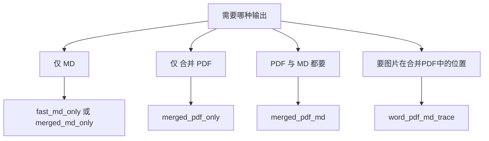
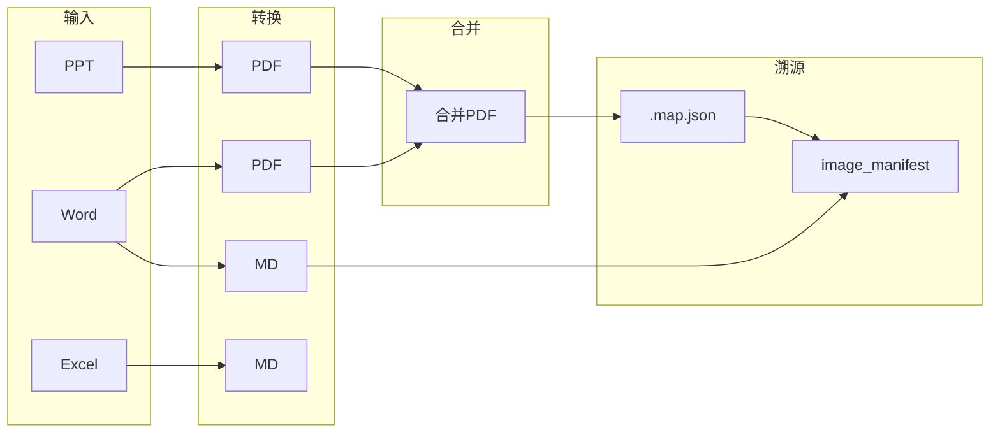

# 配置总览与流程图

本文档汇总 `configs/` 下所有预设、场景、模板与诊断配置的说明，并给出「按场景选预设」与「数据流」流程图。

## 一、配置总览表

### Presets（预设，面向用户加载）

| 路径 | config_kind | description | notes 摘要 |
|------|-------------|-------------|-----------|
| configs/presets/notebooklm/config.presets.notebooklm_merged_md_only.json | preset | NotebookLM 仅合并 Markdown，不上传 PDF，减少文件数量。 | 使用前设置路径；保持溯源开关。 |
| configs/presets/notebooklm/config.presets.notebooklm_merged_pdf_only.json | preset | NotebookLM 仅合并 PDF，保留版式与页码，适合原样排版审阅。 | 使用前设置路径；审阅依赖 PDF 页码时选用。 |
| configs/presets/notebooklm/config.presets.notebooklm_merged_pdf_md.json | preset | NotebookLM 合并 PDF + 合并 Markdown，兼顾检索质量与版式保真。 | 使用前设置路径；需同时出 PDF 与 MD 时推荐。 |
| configs/presets/notebooklm/config.presets.notebooklm_word_pdf_md_trace.json | preset | PPT转PDF、Word转MD+PDF、Excel转MD，Word的PDF合并，图片在合并PDF中的位置可追溯便于LLM理解。 | 使用前设置路径；保留 merge map 与 image manifest。 |
| configs/presets/notebooklm/config.presets.notebooklm_fast_md_only.json | preset | 极速仅 MD 模式，不走 Office/WPS COM，依赖 markitdown。 | 需安装 markitdown；使用前设置路径。 |
| configs/presets/notebooklm/config.presets.notebooklm_incremental_weekly_sync.json | preset | 增量周同步预设，只处理新增/变更，减少全量重跑。 | 需配置 incremental_registry_path；使用前设置路径。 |
| configs/presets/notebooklm/config.presets.notebooklm_traceability_audit.json | preset | 溯源审计预设：独立输出、不合并，便于排查与证据留存。 | 用于排查源文件映射与审计；使用前设置路径。 |

### Scenarios（场景，面向脚本/自动化）

| 路径 | config_kind | description | notes 摘要 |
|------|-------------|-------------|-----------|
| configs/scenarios/notebooklm/config.notebooklm_test.json | scenario | NotebookLM E2E 测试脚本用场景配置，供自动化跑测使用。 | 面向脚本自动化，非用户加载预设；本地执行时调整路径。 |
| configs/scenarios/notebooklm/config.notebooklm_full_md_merge_run.json | scenario | 全量 MD 合并非交互运行场景，供脚本或自动化一次跑完。 | 用于全流程自动化；本地执行时调整路径。 |

### Templates（模板）

| 路径 | config_kind | description | notes 摘要 |
|------|-------------|-------------|-----------|
| configs/templates/config.example.json | template | 基线模板配置，用于手动创建运行配置的起点。 | 复制并填写 source/target 路径；根据场景调整模式与输出开关。 |

### Diagnostics（诊断/排查）

| 路径 | config_kind | description | notes 摘要 |
|------|-------------|-------------|-----------|
| configs/diagnostics/*.json（14 个） | diagnostic | 诊断/排查用配置，用于定向验证或重跑；不建议作为日常默认。 | 用于问题排查或回归验证；运行前调整 source/target 路径。 |

诊断类文件包括：config.core_regression_200.json、config.core_regression_200_final.json、config.core_regression_1000.json、config.core_rerun_29.json、config.core_rerun_29_final.json、config.core_rerun_29_after_engine_fix.json、config.core_ms_single.json、config.core_ms_single_from_report.json、config.core_timeout_probe_3.json、config.core_verify_tail3.json、config.core_single_corrupt_probe.json、config.word_timeout_probe_single.json、config.word_timeout_probe_single2.json、config.timeout_counter_probe.json 等。

---

## 二、按场景选择预设（流程图）

根据「需要哪种输出」选择对应预设：

- **仅 MD**：极速出 MD 用 `fast_md_only`；要合并 MD 用 `merged_md_only`。
- **仅合并 PDF**：`merged_pdf_only`。
- **PDF 与 MD 都要**：`merged_pdf_md`。
- **要 Word 内图片在合并 PDF 中的位置便于 LLM 理解**：`word_pdf_md_trace`（合并 PDF + merge map + image manifest）。

---

## 三、数据流（转换与合并）

Office 源文件经转换、合并与溯源产出的关系如下：

- **转换**：PPT→PDF；Word→MD 和/或 PDF；Excel→MD（由 `output_enable_pdf`、`output_enable_md`、`enable_fast_md_engine` 等控制）。
- **合并**：Word/PPT 的 PDF 可合并为合并 PDF；MD 可合并为合并 MD（由 `enable_merge`、`output_enable_merged` 等控制）。
- **溯源**：合并 PDF 对应 `.map.json`（源文件 → 合并 PDF 页码）；合并 MD 时可生成 `image_manifest`，记录 Word 内图片与合并 PDF 页码的对应关系，便于 LLM 理解（`enable_merge_map`、`enable_markdown_image_manifest`）。

---

## 四、运行时存储（v5.20.0 起）

任务中心模式下，除 `config.json` 外还有以下存储路径：

| 路径 | 内容 | 生成 / 清理 |
|------|------|-------------|
| `config_profiles/task_<id>.json` | 每任务独立配置 profile（`project_config` + `overrides` 合并后的完整配置） | 新建/保存任务时由向导写入；删除任务时一并清除 |
| `tasks/tasks_index.json` | 任务列表元数据（id、name、binding、status 等） | `TaskStore.save_task` 维护 |
| `tasks/task_<id>_checkpoint.json` | 任务运行断点 | 运行时定期写入；完成后可清空 |
| `tasks/schedules.json` | 定时任务计划（HH:MM、频率、启用状态） | 「定时运行」按钮 / 「定时一览」维护 |

向导写入 `overrides` 时可能新增以下键（若与项目默认不同）：

| Key | 含义 | 来源 |
|-----|------|------|
| `run_mode` | 运行模式 | 向导第 2 步 |
| `output_enable_pdf` / `output_enable_md` | PDF / MD 开关 | 向导第 3 步 |
| `output_enable_merged` / `output_enable_independent` | 合并 / 独立输出 | 向导第 3 步 |
| `merge_mode` / `max_merge_size_mb` / `merge_filename_pattern` | 合并参数 | 向导第 3 步 |
| `collect_mode` | 复制 + 索引 / 仅索引 | 向导第 3 步（collect_only 模式） |
| `allowed_extensions` | 按桶（word/excel/ppt/pdf/cab）配置允许扩展名 | 向导第 3 步 chip 编辑器 |
| `global_md5_dedup` | 按类型全局 MD5 去重（复制模式不受此开关控制，始终按 SHA256 内容去重） | 向导第 3 步去重策略 |

## 五、相关文档

- [CONFIG_PRESETS_NOTEBOOKLM.md](CONFIG_PRESETS_NOTEBOOKLM.md)：NotebookLM 预设详细说明与溯源清单。
- [configs/README.md](../../configs/README.md)：configs 目录结构与 `_meta` 约定；配置说明在「加载配置」界面备注列的展示方式。
