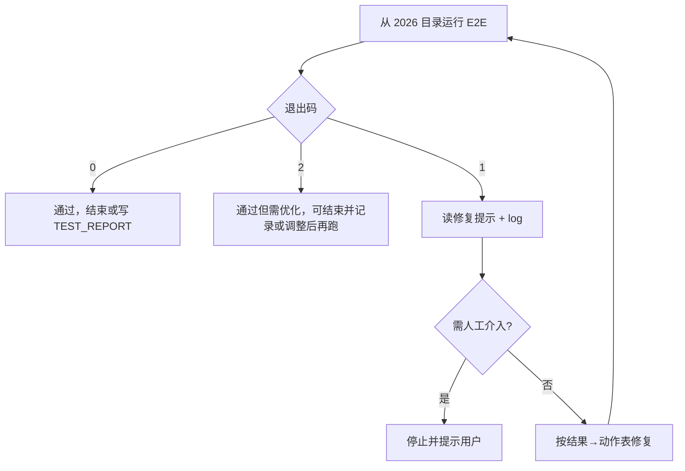

# NotebookLM E2E 计划：第一性原理审阅与修改版

## 1）核心目标与成功标准

**核心目标**  
让 Cursor Agent 能对「NotebookLM 知识库（源 5_投标 → 目标 ZWPDFTSEST）」执行一次可重复的 E2E 测试；若失败，Agent 能在同一会话内按决策表修复并重跑直到通过，或产出修复提示文件供下一轮/新会话的 Agent 修复后由用户再跑。文档与脚本共同约定：谁跑、谁修、谁循环、如何判定通过/失败。

**受众**  
- 执行测试与修复的 Cursor Agent（读计划、跑脚本、读 log、改配置/代码）  
- 触发 Agent 或把修复提示交给新会话的用户  
- 后续维护该计划与 E2E 脚本的人  

**成功标准（可检验）**  
1. **可执行**：从约定工作目录执行一条文档中写明的命令，即可跑完一次 E2E，得到确定退出码（0/1/2）及机器可读结果（JSON）；无需人工输入。  
2. **失败可消费**：当退出码 ≠ 0 时，在约定路径存在修复提示文件，且包含 `log_path`、`error_category` 及指向决策表的引用，足以让 Agent 选择动作。  
3. **决策表完整**：测试计划第六节包含以 `error_category` 为键的结果→动作表，且与 E2E 脚本实际输出的 category 枚举一致；并写明「须循环直至退出码 0 或需人工介入」。  
4. **Agent 可发现规则**：AGENTS.md（或模板）中有一条可被 Agent 读到的规则：NotebookLM E2E 须循环运行直至通过，并注明测试计划第六节路径与修复提示文件路径。  
5. **脚本与约定一致**：存在 `scripts/run_notebooklm_e2e.py`，支持 `--config`、`--output`，失败时写入约定路径的修复提示文件；在约定 cwd 与 config 下运行，行为符合上述通过/失败定义。

---

## 2）问题清单（按严重程度）

### 致命

- **目标表述过宽**：「程序没有 bug 或运行顺利」不可检验；计划只能保证「E2E 退出码 0」与产物检查通过，不能保证程序无 bug。应收窄为「E2E 通过（退出码 0）」「测试顺利跑完」。  
- **无交互前提未验证**：方案依赖 `OfficeConverter(config_path, interactive=False).run()` 在无 GUI、无用户输入下完整跑完。若 `run()` 或调用链中存在 `input()`、GUI 弹窗等，脚本会卡住。【已核实，见下文「核实结果」】  
- **error_category 与决策表脱节**：决策表列了 path_not_found、permission、office_com、config、llm_hub_empty、file_too_large 等，但未约定 E2E 脚本如何从 log/状态得出这些值（关键字？枚举？）。若脚本输出 category 与表不一致，Agent 会选错动作。需约定：脚本输出的 `error_category` 枚举与决策表键完全一致，并文档化确定规则（或注明「见脚本实现」）。

### 重要

- **工作目录未约定**：命令写为 `python scripts/run_notebooklm_e2e.py`，若用户 cwd 是仓库根而脚本在 `2026/scripts/`，则需 `python 2026/scripts/run_notebooklm_e2e.py`；config 默认路径也会随 cwd 变化。需明确「从 2026 目录运行」或「从仓库根运行且脚本路径为 2026/scripts/...」。  
- **「明确需人工介入」未定义**：规则要求「直至退出码 0 或明确需人工介入」，但未定义何种情况算需人工介入。Agent 可能对无法修复的情况（如无 Office、权限不足）无限重试。应在规则中列举或引用需人工介入的 `error_category`（如 permission_denied、office_not_installed），或写明「若同一 error_category 连续 N 次仍失败则停止并提示人工介入」。  
- **config 生成依据模糊**：「由脚本按文档四、推荐配置小结生成」——文档是表格式推荐值，不是完整 JSON schema。脚本需与 `config.example.json` 或 `converter/default_config` 对齐的键列表。【已核实，见下文「核实结果」E2E 最小 config 键表】  
- **退出码 2 与「不得在未通过时结束」的张力**：退出码 2 表示「成功但需优化」（如文件数>50、单文件>200MB）。若规则是「不得在未通过时结束」，则 2 应视为「可通过但建议再跑」还是「未通过必须再跑」？需明确：例如「退出码 2 视为通过，可结束并记录；若希望符合 NotebookLM 50 来源限制则调整配置后再跑」。

### 可优化

- **重复表述**：「涉及哪些 AI、如何调用」与「实现思路概览」中「同一 AI 会话」「启动 AI 自己修复」重复；可合并为一小节，避免两处维护。  
- **方式 B 的循环依赖用户**：方式 B 下新 Agent 修完后「建议用户再跑 E2E」，若用户不跑则循环断掉。非逻辑错误，但成功标准依赖用户行为；可在受众/成功标准中注明「方式 B 下循环由用户多轮发起完成」。  
- **冗余总结句**：「这样，无论是……都有统一约定……」等可删，保留硬核约定即可。  
- **流程图**：当前图将退出码 1 和 2 都导向「读+修+再跑」。若退出码 2 定为「可通过可结束」，则应在图中区分 1→循环、2→可选结束。

---

## 核实结果（两项已执行）

**1）run() 调用链是否含 input() / messagebox 等阻塞？**  
结论：**interactive=False 时不会发生 input() 阻塞**。依据：`run_workflow.run()` 仅在 `converter.interactive` 为 True 时调用 `ask_retry_failed_files()`（会 input）；`_confirm_continue_missing_md_merge` 传 `converter.interactive`，False 时直接 return True。GUI/messagebox 仅在 office_gui 与 gui/mixins 中，run 路径不引用。**建议**：E2E config 设 `"auto_open_output_dir": false`（或设环境变量 `ZW_TEST_MODE=1`），避免 run 结束后 `os.startfile(open_dir)` 打开资源管理器。

**2）E2E 最小 config 键与文档「四、推荐配置小结」对齐**  
结论：**脚本应以 default_config 或 config.example 为基，保证 `config_validation.validate_runtime_config_or_raise` 所需键齐全，再覆盖测试计划表项**。文档表对应键：source_folder/source_folders、target_folder、run_mode、output_enable_pdf/md/merged/independent、enable_llm_delivery_hub、llm_delivery_flatten、upload_dedup_merged、enable_merge_map、bookmark_with_short_id。校验强制键见 `converter/config_validation.py`（run_mode、collect_mode、content_strategy、default_engine、kill_process_mode、merge_mode、merge_convert_submode、timeout/pdf_wait/ppt 相关、parallel_workers、若干布尔与列表）。E2E 生成 config 时另设 **auto_open_output_dir: false**。

---

## 澄清结论（执行前约定）

以下三项已与需求方确认，落实时按此执行：

1. **规则写入位置**：NotebookLM E2E「循环直至通过」规则只写进 **2026/AGENTS.md**，不要求修改 `docs/AGENTS_TEMPLATE.md`。
2. **源/目标路径可覆盖**：E2E 脚本支持通过 **参数（如 --source / --target）或环境变量** 覆盖源目录与目标目录，便于在 CI 或无 Z: 盘环境使用其他路径或跳过。
3. **退出码 2 仍写修复提示文件**：即使 E2E 以退出码 2（成功但需优化）结束，也**写入**同一路径的修复提示文件。  
   **说明**：退出码 2 表示转换已跑完、_LLM_UPLOAD 也有内容，但可能文件数>50 或单文件>200MB，不符合 NotebookLM 免费版限制。此时 Agent 可以有两种选择：(A) 视为通过，结束并记录到 TEST_REPORT；(B) 按决策表「调整 max_merge_size_mb 或合并策略后再跑」，让产物满足 50 来源/200MB 限制。若退出码 2 时也写修复提示文件，Agent 会拿到与失败时相同的结构化信息（log_path、error_category=file_too_large_or_many、决策表引用），便于在**同一套流程**里选择 (B)：读修复提示 → 按表改配置 → 再跑 E2E。若不写，Agent 只能看到结果 JSON 和退出码 2，没有统一的「下一步动作」入口，选择 (B) 时还要再去翻决策表；写的话则与退出码 1 的处理一致，方便「想继续优化就按提示再跑一轮」。

4. **长时间运行与「所有情况都测到」**（见下一小节）。

---

## 长时间运行与「所有情况都测到」的考虑

本次测试目录内文档多、单次运行可能很久，且希望尽量覆盖所有情况。程序与计划已做的和建议补充如下。

**当前程序已支持的（长时间/大目录）**

- **无 E2E 总超时**：E2E 脚本只调用 `converter.run()` 并等待结束，不设整次运行的时间上限，跑几小时也会等完。
- **转换器侧**：  
  - **office_restart_every_n_files**（默认 25）：每处理 N 个文件重启一次 Office/WPS，减轻长时间运行时的内存占用。  
  - **sandbox_min_free_gb**（默认 10）：开跑前检查沙箱所在盘剩余空间，不足可拒绝或提示。  
  - **enable_checkpoint / checkpoint_auto_resume**（默认开）：顺序批处理会按间隔把进度写入 `_AI/checkpoints/`，下次用**同一 config、同一源目录**再跑时，会自动只处理未完成文件（断点续跑），无需从头再来。  
  - **timeout_seconds / ppt_timeout_seconds**：单文件转换超时，不是整次运行超时。

**建议 E2E 生成 config 时对大目录做的**

- 保持或显式设置：**enable_checkpoint: true**、**checkpoint_auto_resume: true**、**office_restart_every_n_files**（如 25 或按机器情况略调大）、**sandbox_min_free_gb**（按本机盘空间设，避免跑一半因空间不足失败）。  
- 这样「一次跑很久」时既有断点续跑，又降低 Office 内存和磁盘风险。

**「所有情况都测到」的含义与做法**

- **单次 E2E 只会得到一个结果**：退出码 0（通过）、1（失败）或 2（成功但需优化）；以及一个 `error_category`（若失败/需优化）。  
- 若要覆盖**多种**结果和多种错误类型（例如 path_not_found、llm_hub_empty、file_too_large_or_many 等），需要**多轮运行**，例如：  
  - 第一轮：全量跑当前大目录 → 得到 0 或 2（或 1，若中途出错）；  
  - 若得到 2：可读修复提示，按决策表调 max_merge_size_mb 等再跑，验证「优化后再跑」能得到 0；  
  - 若想验证失败分支：可用错误路径或错误 config 再跑一次 E2E（如源目录不存在 → path_not_found）；  
  - 运行中途若中断（关终端、崩溃）：用同一 config 再执行同一 E2E 命令，转换器会从 checkpoint 续跑，不必重头扫全量。  
- 计划与 E2E 不要求「一次跑完所有场景」，但把上述建议写进文档，方便你安排长时间测试和多轮验证，尽量覆盖成功、失败、需优化及多种 error_category。

---

## 3）修改后的版本

### 目标与受众

- **目标**：使 Cursor Agent 能对 NotebookLM 知识库场景（源 `Z:\Schneider\5_投标`，目标 `D:\ZWPDFTSEST`）执行可重复 E2E；失败时在同一会话内按决策表修复并重跑直至**E2E 通过（退出码 0）**，或产出修复提示供下一会话/用户修复后再跑。  
- **受众**：执行测试与修复的 Cursor Agent；触发或转交修复提示的用户；计划与脚本的维护者。  
- **不包含**：额外 AI 服务或 API；脚本内「调用 AI」。参与方仅为 Cursor 会话中的 Agent（当前会话或用户新开的会话）。

### 成功标准（可检验）

1. 从约定工作目录执行文档中写明的命令，得到确定退出码 0/1/2 及机器可读结果（JSON），无需人工输入。  
2. 退出码 ≠ 0 时，约定路径存在修复提示文件，含 `log_path`、`error_category`、决策表引用。  
3. 测试计划第六节包含与脚本 `error_category` 一致的结果→动作表，并写明须循环直至退出码 0 或需人工介入。  
4. AGENTS.md（或模板）中有规则：NotebookLM E2E 须循环直至通过，并注明第六节与修复提示路径。  
5. E2E 脚本存在且行为与通过/失败定义及输出约定一致。

---

### 谁在做、谁在循环、如何触发

- **执行者**：Cursor 当前会话的 Agent（能跑终端、读文件、改配置/代码）。  
- **触发**：用户对 Agent 说一句，如「按 NotebookLM 测试计划跑 E2E 并循环修复直到通过」或「执行测试计划第六节」。  
- **循环**：Agent 在本会话内多轮执行：运行 E2E 命令 → 若退出码 ≠ 0 则读修复提示文件与 log，按结果→动作表修改 → 再运行 E2E，直到退出码 0 或遇到需人工介入的 category。  
- **需人工介入**：以下情况 Agent 应停止循环并提示用户：`error_category` 为 permission_denied、office_not_installed（或等价），或同一 category 连续 2 次修复后仍失败。【待实现：脚本是否输出此类 category，与决策表同步】  
- **方式 B**：用户自己跑 E2E 失败后，将修复提示文件路径或内容交给新对话的 Agent，由其修复并建议用户再跑；循环由用户多轮发起完成。

---

### 可执行规格

- **工作目录**：以 **2026** 为当前工作目录（即 `d:\GitHub\ZhiWei2026\2026` 或项目内 2026 目录）。  
- **命令**：`python scripts/run_notebooklm_e2e.py`（可选 `--config ...` `--output ...` `--repair-prompt ...`）。  
- **config**：默认 `config.notebooklm_test.json`（相对 2026 目录）；若不存在则由脚本生成。生成时以 `converter.default_config` 的默认 dict（或 config.example.json）为基，保证 `config_validation.validate_runtime_config_or_raise` 所需键齐全，再覆盖测试计划「四、推荐配置小结」表项及 **auto_open_output_dir: false**。**大目录/长时间运行**：建议保留或显式设置 **enable_checkpoint: true**、**checkpoint_auto_resume: true**、**office_restart_every_n_files**（如 25）、**sandbox_min_free_gb**（按本机设置），以便断点续跑并降低长时间运行风险（见上文「长时间运行与所有情况都测到」）。  
- **运行方式**：脚本内部 `OfficeConverter(config_path, interactive=False).run()`，不调用 `cli_wizard()` 或调用亦可（interactive=False 时 wizard 不阻塞）。**已核实**：run 调用链在 interactive=False 下无 input()/弹窗；E2E 生成的 config 须设 `"auto_open_output_dir": false`（或脚本设 ZW_TEST_MODE=1）避免结束后打开资源管理器。  
- **日志**：run 后 `converter.log_path` 为本次 log，脚本在结果中返回。

---

### 通过/失败/需优化定义

- **通过（退出码 0）**：进程退出码 0；无未捕获异常；log 中无 Traceback 或约定关键错误；`<target>/_LLM_UPLOAD` 存在且（convert_then_merge 时）非空或存在 manifest；`llm_upload_manifest.json` 存在且合法 JSON。  
- **失败（退出码 1）**：退出码 ≠0 或 run 中异常；或 log 含 Traceback/关键错误；或 _LLM_UPLOAD 应为非空但为空。  
- **成功但需优化（退出码 2）**：满足「通过」但 _LLM_UPLOAD 文件数>50 或单文件>200MB。**约定**：退出码 2 视为 E2E 通过，Agent 可结束并记录；若需满足 NotebookLM 50 来源/200MB 限制，则调整配置后再跑。

脚本输出：结果 JSON 含 `success`、`log_path`、`llm_upload_dir`、`file_count`、`max_file_size_mb`、`errors`、`error_category`、`message`；退出码 0/1/2。

---

### 失败时的修复提示文件

- **路径**：`docs/test-reports/notebooklm_e2e_repair_prompt.txt`（或 `--repair-prompt` 指定）。  
- **写入条件**：退出码 1 或 2 时写入。  
- **内容至少包含**：`log_path`（绝对路径）、`result_json` 路径、`error_category`（与决策表键一致）、`errors` 摘要；以及「按测试计划第六节结果→动作表修复后重新运行 E2E」的引用与示例命令。

---

### 结果→动作表（与 error_category 一致）

脚本输出的 `error_category` 枚举必须与下表键一致；决策表写在测试计划第六节。

| error_category        | AI 动作 |
|-----------------------|--------|
| path_not_found        | 创建缺失目录或修正 config 中 source/target，再跑 E2E |
| permission_denied      | 检查目标目录权限或换可写路径；若无法解决则停止并提示人工介入 |
| office_not_installed   | 检查 Office/WPS 安装与 COM；若无法解决则停止并提示人工介入 |
| office_com             | 检查 Office/WPS/COM 或切 engine，再跑 |
| config                 | 检查 config 键与值，对照文档修正，再跑 |
| llm_hub_empty          | 检查 enable_llm_delivery_hub、run_mode、output_enable_* 及 corpus_manifest 调用，修正后再跑 |
| file_too_large_or_many | 记录到 TEST_REPORT，调整 max_merge_size_mb 或合并策略后再跑，或标记需优化后结束 |

当同一 category 连续 2 次修复后仍失败，Agent 应停止并提示人工介入。

---

### E2E 脚本职责（`scripts/run_notebooklm_e2e.py`）

- **参数**：`--config`（默认 `config.notebooklm_test.json`）、`--output`（结果 JSON 路径）、`--repair-prompt`（修复提示文件路径，默认 `docs/test-reports/notebooklm_e2e_repair_prompt.txt`）。  
- **逻辑**：若 config 不存在则**以 default_config 或 config.example 为基**生成并写入（含校验所需键 + 测试计划表项 + auto_open_output_dir: false）；实例化 `OfficeConverter(config_path, interactive=False)` 并调用 `run()`；根据 run 结果与 log 检查 _LLM_UPLOAD、manifest、文件数与单文件大小；设定 `error_category`（枚举与结果→动作表一致）；写结果 JSON；若退出码 ≠0 则写修复提示文件；返回退出码 0/1/2。  
- **error_category 确定规则**：由脚本根据异常类型、log 关键字、产物状态设定，具体枚举及规则见脚本实现并与本文「结果→动作表」保持一致。

---

### 规则（写入测试计划第六节与 AGENTS）

- **测试计划第六节**：  
  - AI 执行策略：执行 NotebookLM E2E 时须循环：运行 `python scripts/run_notebooklm_e2e.py`（从 2026 目录）→ 若退出码非 0，则根据结果 JSON 与修复提示文件及 log 按本节结果→动作表修复 → 再次运行同一命令，直至退出码 0 或遇到需人工介入的 category 或同一 category 连续 2 次仍失败。不得在未达到上述结束条件时结束。  
  - 可执行规格、通过/失败定义、结果→动作表、修复提示文件路径同上。  
- **AGENTS.md（或模板）**：  
  - 一条：NotebookLM 知识库 E2E 须循环运行直至通过或需人工介入。见 `docs/plans/NotebookLM_知识库测试计划_5_投标_ZWPDFTSEST.md` 第六节；命令：在 2026 目录下 `python scripts/run_notebooklm_e2e.py`；失败时修复提示：`docs/test-reports/notebooklm_e2e_repair_prompt.txt`。

---

### 涉及文件与改动

| 文件 | 改动 |
|------|------|
| 测试计划 `NotebookLM_知识库测试计划_5_投标_ZWPDFTSEST.md` | 新增第六节：可执行规格（含 cwd、命令）、通过/失败/需优化定义、结果→动作表（与 error_category 枚举一致）、AI 执行策略（含需人工介入与连续失败停止）、修复提示路径。 |
| `2026/scripts/run_notebooklm_e2e.py` | 新建。实现 config 生成/加载、无交互 run、检查、结果 JSON、失败时写修复提示、error_category 与表一致、退出码 0/1/2。 |
| `2026/AGENTS.md` 或 `docs/AGENTS_TEMPLATE.md` | 增加一条：NotebookLM E2E 须循环直至通过或需人工介入；第六节路径；命令与修复提示路径。 |

---

### 流程示意

---

## 4）修改摘要（改了什么、为什么）

| 修改项 | 原因 |
|--------|------|
| 目标收窄为「E2E 通过 / 测试顺利跑完」，删除「程序没有 bug」 | 「无 bug」不可检验；计划只能保证 E2E 退出码 0 与产物检查。 |
| 明确工作目录为 2026，命令与路径相对 2026 | 避免 cwd 歧义导致命令或 config 路径错误。 |
| 定义「需人工介入」：permission_denied、office_not_installed 或同一 category 连续 2 次仍失败 | 避免 Agent 无限重试；给出可执行的停止条件。 |
| 退出码 2 约定为「视为通过，可结束并记录」；若需符合 50/200MB 则调整后再跑 | 消除与「不得在未通过时结束」的张力；明确 2 的处理。 |
| 结果→动作表与 error_category 枚举强制一致，并增加 permission_denied、office_not_installed | 使 Agent 能根据脚本输出唯一选择动作；需人工介入的 category 显式列出。 |
| 合并「涉及哪些 AI」与「实现思路」为「谁在做、谁在循环、如何触发」一节 | 去除重复，单点维护。 |
| 增加【待核实】与【待实现】标注及核实方法 | OfficeConverter 无 input/弹窗、config 最小键已核实并写入「核实结果」；error_category 与脚本实现需在实现时与表一致。 |
| 删除冗余总结句、重复表述 | 只保留可执行约定，便于 Agent 与维护者使用。 |
| 流程图区分退出码 1 与 2，并增加「需人工介入」分支 | 与文字约定一致，避免误解。 |
