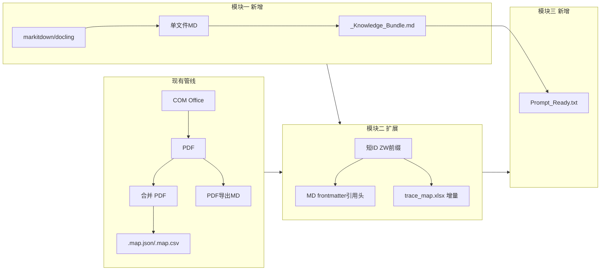

# ZhiWei V6.0 需求书与当前项目符合度评估

## 一、结论概览

需求书与当前项目**整体对齐**，核心痛点（大模型引用无法反查本地原文件）在现有架构中已有**部分实现**（短 ID、map 映射、locate_source）。模块一（极速 MD 引擎）和模块三（Prompt 包裹器）为**新增能力**；模块二（溯源锚点）需在现有短 ID/映射体系上**扩展**（MD 头、统一 trace_map 增量）；模块四（GUI）沿用现有配置与控件模式即可。

---

## 二、当前项目已具备的能力（可直接复用）

| 需求书描述 | 当前实现位置 | 说明 |
|------------|--------------|------|
| 短 ID 生成 | office_converter.py `_build_short_id(md5_value, taken_ids)`（约 3545 行） | 基于 MD5 取前 8 位大写，保证同批唯一；用于合并 PDF 的 bookmark 与 map |
| 合并 PDF 的映射与溯源 | 同文件 `_write_merge_map()`（3556 行）、`merge_pdfs()` 内 map_records（3729–3770 行） | 每份合并 PDF 对应 `.map.json` + `.map.csv`，含 `source_short_id`、`source_abspath`、`source_filename` 等 |
| 按短 ID/页码反查原文件 | locate_source.py `locate_by_short_id()`、`locate_by_page()` | 读 `_MERGED` 下 `.map.json`，返回源文件绝对路径；可与 Everything/Listary 配合 |
| Bookmark 中带短 ID | office_converter.py 3733–3734 行，配置 `bookmark_with_short_id` | 合并 PDF 书签格式为 `[ID:{source_short_id}] {filename}` |
| Markdown 输出 | 同文件 `_export_pdf_markdown()`（4865 行起） | 当前路径：COM→PDF→pypdf 抽文本→清理→单文件 .md；头部有 source_pdf、page_count 等，**无短 ID** |
| 运行模式与输出开关 | run_mode、merge_convert_submode、output_enable_md 等，gui_task_workflow_mixin.py、gui_config_*.py 多处 | 已有“合并+转换”子模式（含 PDF_TO_MD）、MD 开关、配置持久化到 config.json |
| 配置与 GUI 模式 | ttkbootstrap、多 Tab、config 读写 | 新增 3 个 checkbox + 保存到 config 与现有模式一致 |

---

## 三、按模块的符合度与差距

### 模块一：极速 Markdown 转换引擎

| 需求点 | 符合度 | 说明与建议 |
|--------|--------|------------|
| 引入 markitdown/docling，独立于 COM | **当前无** | 现有 MD 来自「COM→PDF→pypdf 抽文本」，无直接 Office→MD；需新增依赖（如 `markitdown`）和一条**独立流水线**（不经过 COM），与现有 convert 并行可选 |
| 直出 MD 语料包（只输出 MD） | **部分** | **已确认：该模式只输出 MD，不出 PDF。** 在输出计划中增加「极速 MD 模式」：仅生成 MD 语料与 _Knowledge_Bundle.md，统一输出目录（如 `_MD_Corpus/`），不走 COM/PDF 管线。 |
| 多 MD 合并为 `_Knowledge_Bundle.md`，`---` + `# 原文件名` | **当前无** | 现有仅 MSHelp 有“多 MD 合并”；需新增：收集本批生成的 .md，按顺序拼接，分隔符 `---`，每段一级标题 `# 原文件名` |

**结论**：模块一为**新增能力**，需新引擎 + 新输出产物 + 新合并逻辑；与现有 COM/PDF 管线并存，不替代现有流程。

---

### 模块二：深度溯源锚点注入

| 需求点 | 符合度 | 说明与建议 |
|--------|--------|------------|
| 短 ID 生成器 | **已有** | `_build_short_id()` 可直接复用；若需“ZW-XXXX”格式，可在其外再包一层前缀或增加配置项 |
| MD 内锚点：YAML frontmatter 或引用头 | **当前无** | 现有 `_export_pdf_markdown()` 头部无短 ID；需在写 MD 时写入 frontmatter 或首行块引用：`> [系统溯源标识] 原始文件: {文件名} \| 提取短 ID: {短 ID}` |
| PDF 每页顶部水印 | **不做** | 产品确认：不需要水印功能；不实现，保留现有 bookmark 带短 ID 即可。 |
| 本地映射账本 `trace_map.xlsx`（短 ID、原文件名、绝对路径） | **部分** | 现有为“每份合并 PDF”对应 .map.json/.map.csv。**已确认支持增量**：同一输出目录下单文件，按短 ID 去重/更新，当次运行追加或更新记录，便于长期溯源。 |

**结论**：模块二在**现有短 ID + map + locate_source** 上扩展即可：MD 头注入、统一 trace_map（支持增量）；短 ID 采用 ZW- 前缀（如 ZW-A1B2C3D4），locate_source 查询时 strip 前缀以兼容 .map。不做 PDF 水印。

---

### 模块三：方案生成包裹器 (Prompt_Ready.txt)

| 需求点 | 符合度 | 说明与建议 |
|--------|--------|------------|
| GUI 勾选 + 模板类型下拉 | **当前无** | 纯新增：一个 checkbox（如“生成 Prompt 模板”）+ 下拉（新方案撰写 / 历史技术澄清总结 / 设备清单提取等），状态写入 config |
| 输出 `Prompt_Ready.txt` | **当前无** | 在已有“合并 MD”或“语料包”生成后，按选定模板拼装【系统指令】+【参考资料开始】+ 带短 ID 的 MD 内容 +【参考资料结束】，写入输出目录 |
| 模板结构 | **当前无** | 模板可放配置或代码内常量；占位“请在此处输入你的具体需求”可与下拉选项对应 |

**结论**：模块三为**全新功能**，依赖“带短 ID 的语料内容”就绪（模块一/二），实现为独立输出步骤 + GUI 两项。

---

### 模块四：GUI 同步更新

| 需求点 | 符合度 | 说明与建议 |
|--------|--------|------------|
| 三 checkbox + 写入 config | **高度一致** | 现有已有 `output_enable_md`、`bookmark_with_short_id`、`merge_convert_submode` 等及 gui_config_save_mixin.py 的保存逻辑；新增 3 个键即可，例如：`enable_fast_md_engine`、`enable_traceability_anchor_and_map`、`enable_prompt_wrapper`，对应需求书中的三项 |

**结论**：与当前项目 GUI/配置模式完全一致，按现有方式扩展即可。

---

## 四、需求书与实现顺序的建议

需求书末尾要求“**优先模块二（短 ID 注入与映射表）+ 模块一（极速 Markdown）**”的方案，与项目现状匹配且可落地：

1. **模块二优先**合理：短 ID 与 map 已有，只需扩展——(1) 在**单文件 MD 生成路径**也生成并写入短 ID（frontmatter/引用头），短 ID 采用 ZW- 前缀；(2) 汇总写出并**增量更新** `trace_map.xlsx`。不做 PDF 水印。这样“带短 ID 的语料”先就绪，模块三和模块一的合并 MD 都能直接复用。
2. **模块一随后**：接入 markitdown（或 docling），增加“极速 MD”模式与 `_Knowledge_Bundle.md` 合并；在该路径同样走“短 ID + 映射表”逻辑，与模块二共用 trace_map。
3. **模块三**在“带短 ID 的语料”和“合并 MD/语料包”可用后再做，避免重复改语料格式。
4. **模块四**可与模块一/二/三同步加 3 个控件与 config 键。

---

## 五、需确认点的结论（已确认）

1. **短 ID 格式（哪个更方便追溯？）**  
   **建议采用带 `ZW-` 前缀的短 ID**（如 `ZW-A1B2C3D4`），便于追溯的原因：(1) 在语料和 Prompt 中一眼识别为知喂体系；(2) 与需求书引用格式 `[参考: ZW-XXXX]` 一致；(3) 实现上在现有 8 位 ID 前加前缀即可，locate_source 查询时 strip 前缀再查 .map，兼容现有数据结构。  
   **已按此建议纳入实现范围。**

2. **极速 MD 与现有 PDF/MD 的关系**  
   **已确认：只输出 MD。** 勾选“极速 Markdown 引擎”时，该模式仅生成 MD 语料包（及 _Knowledge_Bundle.md），不生成 PDF、不走 COM 转换。与现有“转换+合并 PDF”为互斥或独立模式，在 output_plan / run_mode 上做“仅 MD”分支即可。

3. **trace_map.xlsx 范围**  
   **已确认：支持增量。** trace_map 需支持增量更新：当次运行的新增/变更文件追加或更新到同一份 trace_map.xlsx（按短 ID 或路径去重），便于长期积累、与 Listary/Everything 配合做全量溯源。实现时需约定：同一输出目录下单文件 trace_map.xlsx，每行“短 ID、原文件名、本地绝对路径”，去重策略（例如以短 ID 为主键，新覆盖旧或保留首次）。

4. **PDF 水印**  
   **已确认：不需要水印功能。** 不实现 PDF 每页顶部水印，模块二不包含该需求；保留现有 bookmark 带短 ID 即可。

---

## 六、借鉴的开源程序与参考链接

以下为 V6.0 实现时需借鉴或集成的开源项目，便于其他 AI 或开发者直接查阅文档与 API。

| 用途 | 项目 | 仓库 / 文档 | 说明 |
|------|------|-------------|------|
| 模块一：极速 Office→Markdown | **MarkItDown** (Microsoft) | https://github.com/microsoft/markitdown | 将 Word/Excel/PPT/PDF 等转为 Markdown，无需 COM；Python API：`from markitdown import MarkItDown; md.convert(path)`。PyPI: `pip install 'markitdown[all]'`，需 Python 3.10+。 |
| 模块一：极速 Office→Markdown（备选） | **Docling** | https://github.com/docling-project/docling | 文档转换 SDK/CLI，支持 DOCX/PPTX/XLSX/PDF 等，导出 Markdown/HTML；适合本地与 RAG 场景。PyPI: `pip install docling`，需 Python 3.10+。文档: https://docling-project.github.io/docling/ |
| 项目已有（参考） | pypdf | https://pypi.org/project/pypdf/ | 当前 PDF 合并与文本抽取已用；MD 由 PDF 导出时依赖。 |
| 项目已有（参考） | openpyxl | https://openpyxl.readthedocs.io/ | 当前合并列表、索引等 Excel 输出已用；trace_map.xlsx 增量写入可复用。 |

**说明**：模块一优先考虑 **markitdown**（Office 支持全、API 简单）；若遇依赖或平台问题可评估 **docling** 作为备选。实现时以官方 README 与 PyPI 说明为准。

---

## 七、简要架构示意（与现有关系）

---

## 八、风险与落地建议

以下为开发与打包落地时需提前防范的工程细节，供开发团队与 AI 执行时遵守。

### 8.1 打包兼容性（PyInstaller / markitdown、docling）

- **风险**：模块一计划引入 markitdown 或 docling，两者底层可能依赖 C++ 编译库或轻量模型权重，在原生 Python 下正常，打包成单 exe 后易出现缺 DLL、路径或资源找不到等问题。
- **建议**：在**全面铺开模块一代码之前**，先写一个**仅调用 markitdown 的最小可运行脚本（MVP）**，用 PyInstaller 打成独立 .exe，在**无开发环境的干净 Windows 虚拟机**中运行验证。若 markitdown 打包不可行，再评估 docling 或补充“极速 MD 仅本地使用、不随 exe 分发”的说明。

### 8.2 大文件内存管理（OOM 风险）

- **风险**：模块一与模块三会将多份 Markdown 合并为 `_Knowledge_Bundle.md`，再与系统指令拼接为 `Prompt_Ready.txt`。若处理海量工业手册或超大设备清单，在内存中做全量字符串拼接可能导致内存溢出。
- **建议**：合并逻辑**必须采用流式追加写入**（例如 `open(path, 'a', encoding='utf-8')`，按文件逐个读入小块、写出一段再处理下一段），**禁止**先将所有内容读入内存再一次性写入。对 _Knowledge_Bundle.md 与 Prompt_Ready.txt 的生成均按此约束实现，保持低内存占用。

### 8.3 旧逻辑兼容性（短 ID 格式变更）

- **风险**：短 ID 由 8 位改为带 `ZW-` 前缀（如 `ZW-A1B2C3D4`）后，若现有代码中存在“长度固定为 8”或“仅字母数字”的严格校验，会导致解析或查询失败。
- **建议**：在修改 `_build_short_id()` 及对外输出短 ID 时，**全局搜索**对 `short_id` / `source_short_id` 的 `len()` 判断、正则或固定长度假设，**同步放宽**为支持 ZW- 前缀（例如长度 ≥ 8、允许 `-` 等）。locate_source 等查询 .map 时，应对用户输入或展示值做** strip 前缀再查**，保证与现有 .map 数据兼容。

---

**总结**：需求书与当前项目实际情况**相符**，可在现有架构上通过“扩展模块二 + 新增模块一/三 + GUI 三项”落地；借鉴的开源项目见**第六节**，风险与落地约束见**第八节**。建议按需求书顺序优先给出模块二与模块一的具体实现方案与任务拆分，再实现模块三与模块四。
