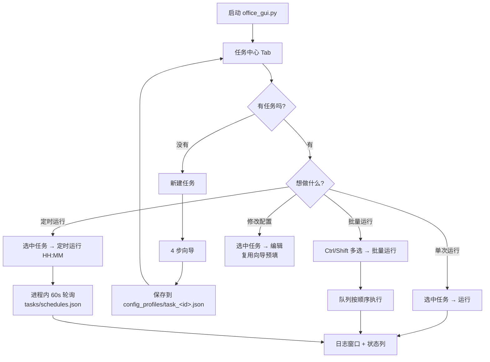
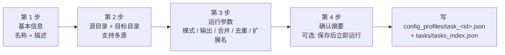
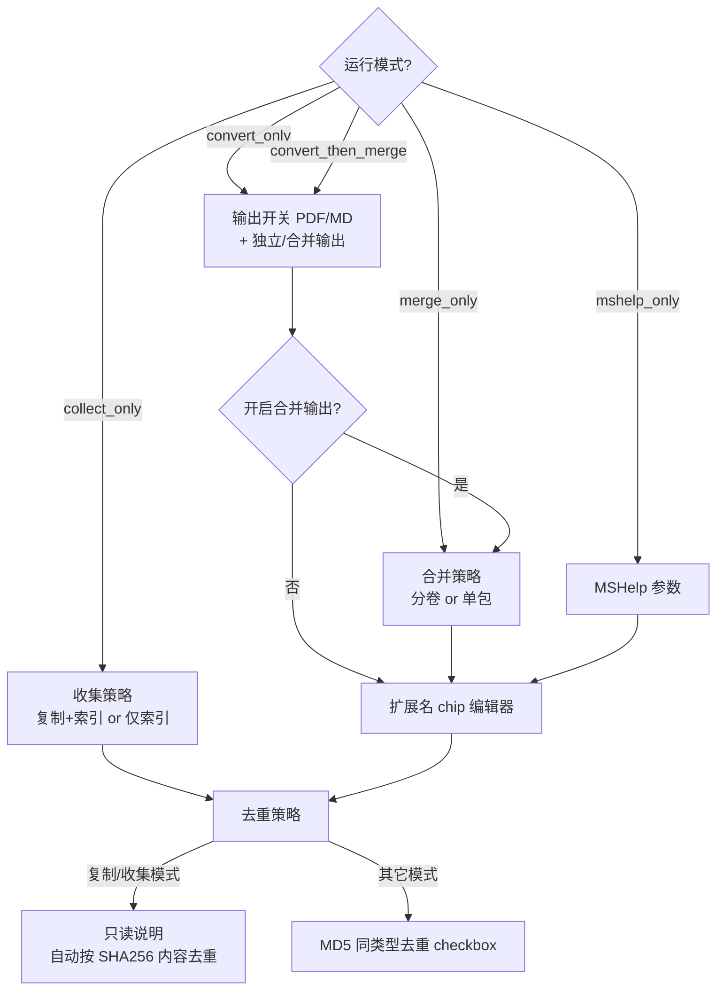
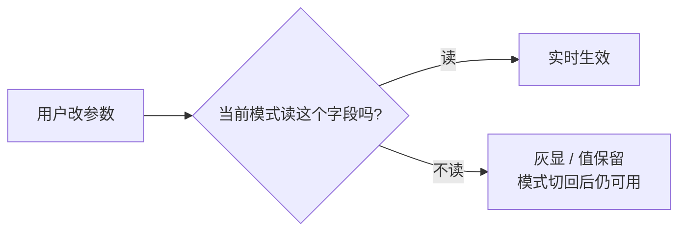

# 引导模式操作手册（详细版）

> 适用版本：v5.20.0
> 目标：按"我想得到什么结果"来操作，而不是记配置键名。

---

## 1. 先看结论

1. v5.20.0 起只有一个运行入口：**任务中心**。所有转换 / 合并 / 采集都从任务列表发起。
2. 新建任务走 **4 步向导**；编辑任务复用同一个向导（标题切为"编辑任务"），所有字段会预填。
3. 每个任务有自己的独立配置（`config_profiles/task_<id>.json`），互不干扰。
4. 想批量跑：多选任务 + 「批量运行」。想定时跑：选任务 + 「定时运行」，程序保持打开即可。
5. 配置页（共用配置 / 转换配置 / 合并配置）只管**项目默认**，具体任务走向导改。

---

## 2. 主流程总览

---

## 3. 新建任务向导（4 步）

### 3.1 第 3 步内的子决策

---

## 4. 去重策略说明

| 模式 | 去重行为 | 能关吗 | 结果在哪看 |
|------|----------|--------|-----------|
| `collect_only` | 按 SHA256 内容去重（永远开） | 否 | 索引 Excel 的 `Duplicates` sheet |
| `convert_only` / `convert_then_merge` | 「按类型全局 MD5 去重」— 向导可勾 | 是 | 日志 + 失败记录 JSON |
| `merge_only` / `mshelp_only` | 仅路径去重（目标已存在则跳过） | 否 | 日志 |

复制模式的二级 dedup（先按文件大小分组，再组内算 SHA256）确保同内容不同名的文件也只存一份。

---

## 5. 常用场景最短路径

### 5.1 "转换并合并，80MB 分卷"

1. 新建任务向导。
2. 第 2 步填源和目标。
3. 第 3 步：模式 = `convert_then_merge` / Output PDF 开 / Merged Output 开 / Merge Logic = `By Category` / Max MB = `80`。
4. 第 4 步确认，勾「保存后立即运行」或保存后再从任务列表点运行。

### 5.2 "只生成一个总 PDF"

第 3 步：模式 = `convert_then_merge` or `merge_only` / Merged Output 开 / Merge Logic = `All In One`。此时 Max MB 即使有值也不参与分卷。

### 5.3 "只做增量转换，不合并"

第 3 步：模式 = `convert_only` / Independent Output 开 / Merged Output 关。
第 2 步的增量开关默认开（按需在向导内关掉）；验证 hash / 重处理改名文件的细项在共用配置页。

### 5.4 "准备给 AnythingLLM 喂文件"

第 3 步：模式 = `collect_only` / 收集策略 = `复制 + 生成索引`。
扩展名按需保留（默认含 Word/Excel/PPT/PDF）。运行后把目标目录（含 `office_index_*.xlsx`）整体导入 AnythingLLM。

### 5.5 "每天凌晨 2 点自动跑"

任务列表 → 选中任务 → 「定时运行」→ 填 `02:00` → 程序保持打开即可。可去工具菜单「定时一览」核对。

---

## 6. 编辑任务：向导完整复用

点任务列表右键 /「编辑」，打开的就是同一个向导：
- 标题变为「编辑任务」
- 所有字段从 `config_profiles/task_<id>.json` 的 overrides 预填
- 保存时回写同一个文件（不会新增任务）
- 自 v5.20.0 起不再有"只改 5 个字段的简化弹窗" — 编辑 = 完整向导

---

## 7. 运行中的判断指南

### 7.1 灰色控件 = 当前模式不读

常见例子：
- `collect_only` 下，合并参数全部灰显
- `all_in_one` 下，`Max MB` 不参与分卷

### 7.2 "我改了但没生效"三问

1. 控件是不是灰色？灰 = 当前模式不读。
2. 改的是项目默认（共用配置页）还是任务 overrides（向导）？任务跑的是**合并后**的配置，项目默认会被 overrides 覆盖。
3. 日志开头有没有「配置摘要」？系统会把自动校正的字段列出来。

### 7.3 任务状态列含义

| 状态 | 含义 |
|------|------|
| `idle` | 未运行 |
| `running` | 正在跑 |
| `succeeded` | 最近一次成功 |
| `failed` | 最近一次失败，看日志 / 失败报告 |
| `checkpoint` | 中途中断，再次点「运行」会询问是否断点续传 |

---

## 8. 运行前自检清单

1. 任务名称唯一（向导会查重）。
2. 源目录至少 1 个、全部存在；目标目录存在且可写。
3. 输出开关和运行模式一致（convert_only 不产合并，勾了 Merged Output 会被系统降权为 Independent）。
4. 合并需求明确：
   - 要分卷 → `By Category` + `Max MB`
   - 要单包 → `All In One`
5. 长任务考虑开启断点续传（共用配置页 `enable_checkpoint`）。

---

## 9. 常见困惑

1. **"Max MB=80 就一定分卷吗"** — 不一定，`All In One` 模式下不分卷，会在提示里说明。
2. **"为什么我的任务都跑同一套配置"** — 你是在共用配置页改的吧？那只改项目默认。任务要走向导或编辑，改到 `overrides`。
3. **"定时任务没触发"** — 程序没保持打开？定时调度是进程内的，关程序就停。
4. **"重复文件被跳过了但我要全部转"** — 复制模式的 SHA256 去重无法关；转换模式去掉「按类型全局 MD5 去重」勾选即可。
5. **"编辑任务的窗口看起来像新建向导"** — 对，自 v5.20.0 起两者共用一套 UI，标题区分。

---

## 10. 建议的个人使用习惯

1. 每次开始前先看 Tooltip，不靠记忆。
2. 常用组合直接**存成任务**，不要再复制粘贴配置。
3. 夜间 / 周末批量任务用「定时运行」。
4. 任务多了用任务列表的筛选 / 排序，别手翻。
5. 新功能试错时先新建"测试任务"指向小样本目录，别在主任务上直接改。
