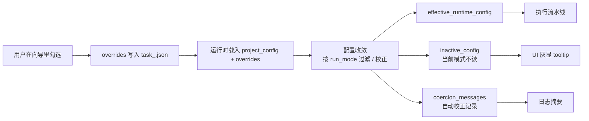
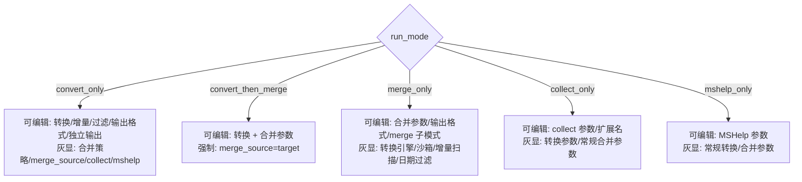
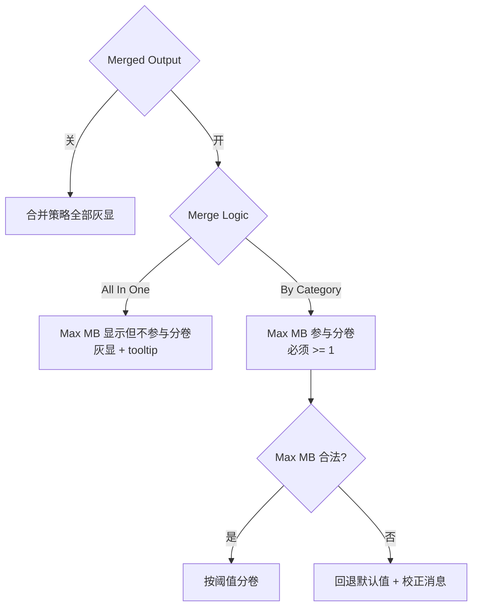
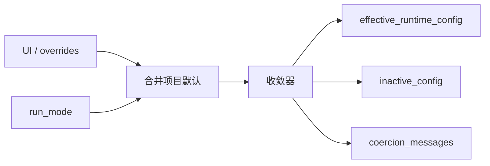
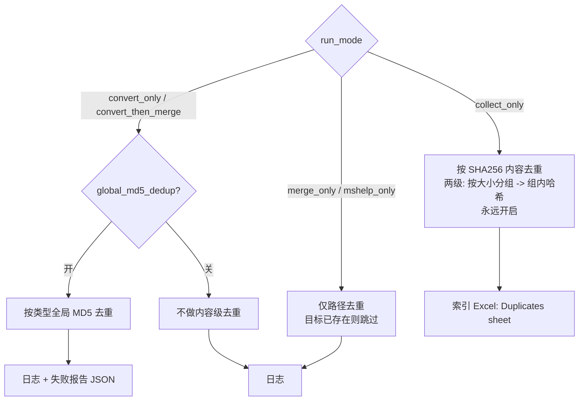
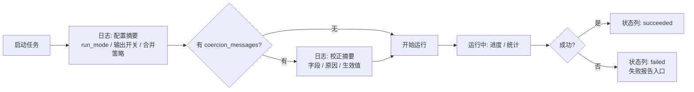
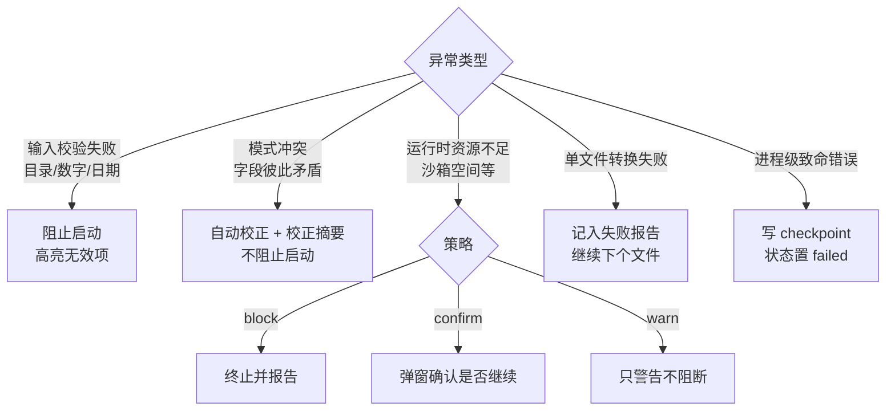

# 引导模式流程文件（执行与校正）

> 适用版本：v5.20.0
> 配套阅读：[操作手册-引导模式.md](操作手册-引导模式.md)
> 目标：把「用户选择 → UI 状态 → 运行配置 → 实际执行」的链路固定下来，减少误判。

---

## 1. 总览：一次任务从向导到执行

- 向导阶段：用户只决定 **overrides**，不动项目默认。
- 运行阶段：系统合并 `project_config + overrides`，再按 `run_mode` 做 **收敛**，产出三份东西：真正生效的 `effective_runtime_config`、被判定不读的 `inactive_config`、自动校正的 `coercion_messages`。
- 用户可见的 UI 灰显与日志摘要都来自这三份产物。

---

## 2. 模式到可编辑区域映射

- 灰显不等于"被删除"：字段的值仍保留，切回兼容模式会恢复可读。
- 「编辑 = 不读」，避免用户在 collect_only 下修改合并参数而误以为生效。

---

## 3. 合并区内部联动

---

## 4. 运行前配置收敛（系统视角）

### 4.1 必做校正规则

1. `run_mode == convert_then_merge` → 强制 `merge_source = target`。
2. `output_enable_merged == false` → 合并区所有字段进入 `inactive_config`。
3. `merge_mode == all_in_one` → `max_merge_size_mb` 进入 `inactive_config`。
4. `merge_mode == category_split` → 校验 `max_merge_size_mb >= 1`；非法则回退默认值并记录到 `coercion_messages`。
5. `run_mode == collect_only` → 复制模式强制启用 SHA256 内容去重（见 §5）。
6. `run_mode in (merge_only, mshelp_only)` → `global_md5_dedup` 进入 `inactive_config`（这两种模式不做内容级去重，只跳路径已存在的目标）。

---

## 5. 去重策略流程

- 两级 SHA256：先按 `(size, ext)` 分组，再在组内算哈希 —— 避免对所有文件暴力哈希。
- MD5 按类型去重 = 同一 bucket（word/excel/ppt/pdf/cab）下相同 MD5 仅保留一份，跨类型不去重。

---

## 6. 日志与提示流程

---

## 7. 异常处理流程

---

## 8. 回归测试最小集合

| 编号 | 场景 | 关键设置 | 预期 |
|------|------|----------|------|
| R1 | 单包不分卷 | `convert_then_merge` + `all_in_one` + `max_mb=80` | 不分卷；日志出现「max_mb 不生效」校正 |
| R2 | 分卷 | `convert_then_merge` + `category_split` + `max_mb=80` | 按 80MB 阈值分卷 |
| R3 | 仅合并 PDF→MD | `merge_only` + pdf_to_md | 走 PDF→MD 子流程，不触发 Office 转换链 |
| R4 | 复制 + 索引 | `collect_only` | 合并和转换参数灰显；SHA256 dedup 自动开 |
| R5 | 旧配置兼容 | 加载含冲突字段的旧 config | 校正摘要正确出现并成功执行 |
| R6 | 任务编辑复用向导 | 已有任务 → 编辑 | 预填正确，保存不新增 id |
| R7 | 定时运行 | 任务 + `HH:MM` | 到时触发，`tasks/schedules.json` 可见 |
| R8 | 断点续传 | 中途中断 + 重新运行 | 询问是否续传，基于 `task_<id>_checkpoint.json` 恢复 |

---

## 9. 关键文件对照

| 流程环节 | 代码 / 存储 |
|---------|-------------|
| 向导 UI | `gui/mixins/gui_task_workflow_mixin.py` |
| overrides 落盘 | `config_profiles/task_<id>.json` |
| 任务索引 | `tasks/tasks_index.json` |
| 断点 | `tasks/task_<id>_checkpoint.json` |
| 定时 | `tasks/schedules.json` |
| 扫描 | `converter/scan_convert_candidates.py` |
| 复制 + SHA256 去重 | `converter/collect_index.py` |
| MD5 去重过滤 | `converter/incremental_filters.py` |
| 合并 | `converter/merge_pdfs.py` / `converter/merge_markdowns.py` |
| 运行编排 | `converter/run_workflow.py` |
