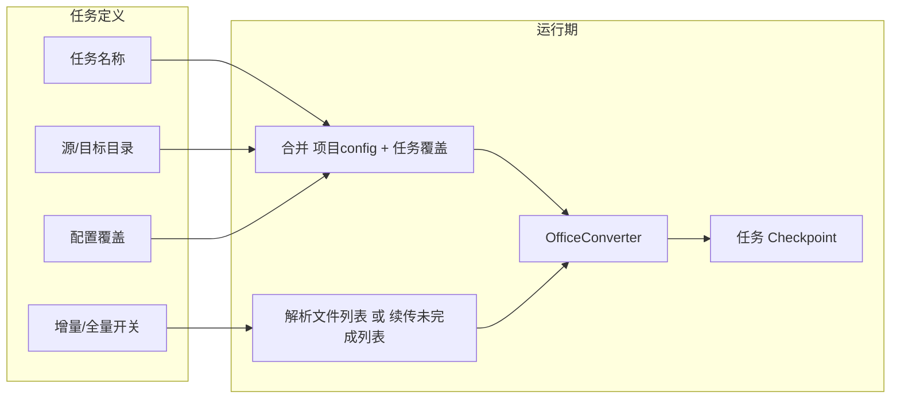

# 任务管理功能规划

## 1. 目标与范围

- **任务**：绑定“固定源目录 + 目标目录 + 一套配置覆盖项”，用于**定期（手动或后续定时）更新**该文件夹的转换结果。
- **任务管理界面**：创建任务、运行任务、终止任务、**断点续传**；任务保存的配置**覆盖**项目 `config.json`，运行任务时不改项目配置。
- **本轮实现**：通过任务定期更新固定文件夹数据；任务运行过一次后，再次运行同一任务默认**增量**（有开关可改为**全部重做**）；**仅手动运行/停止/续传**，定时调度留到后续版本。

## 2. 你可能没想到的问题（设计时需考虑）

| 问题               | 说明与建议                                                                                                                                                                            |
| ---------------- | -------------------------------------------------------------------------------------------------------------------------------------------------------------------------------- |
| **任务与增量账本隔离**    | 每个任务应使用**独立增量账本路径**（如 `target_folder/_AI/registry/task_<task_id>_registry.json`），否则多任务共用同一账本会互相污染。                                                                               |
| **断点续传的粒度**      | 当前“终止”是在**下一个文件前**停止。续传 = 同一任务再次运行且**只处理“上次未处理完”的文件**。实现方式：任务层维护**本次运行 checkpoint**（已处理文件路径集合或“待处理列表 + 已处理索引”），续传时只把“未完成”文件列表交给 converter，或 converter 支持“仅处理给定文件列表”的入口。          |
| **配置覆盖方式**       | 任务宜保存**差异配置**（只存与项目配置不同的项），加载时 `merged = {**project_config, **task_config_overrides}`，避免任务里存一整份重复配置。                                                                             |
| **全部重做 vs 增量**   | “全部重做”= 本次运行忽略该任务的增量账本（或先清空该任务账本再跑），等价于 `enable_incremental_mode=False` 或临时使用空账本。任务需有一项 `run_incremental: true/false`（或 per-run 选项）。                                             |
| **单任务单实例**       | 同一时间只允许一个任务在运行，避免多实例同时写同一目标目录/账本。                                                                                                                                                |
| **任务存储位置**       | 任务列表与 checkpoint 建议存**独立文件**（如 `tasks/tasks.json` + 每任务一个 `task_<id>.json` 或单文件内嵌），便于备份与版本管理，且不污染 `config.json`。                                                                 |
| **续传与 run_mode** | 续传时若只跑“未完成文件”，需要 **converter 支持“仅处理指定文件列表”**。当前 `run()` 是“扫描 → 过滤 → run_batch(全部)”。可选：在 converter 增加 `run_file_list(file_list)` 或 `run(resume_file_list=...)`，任务层在续传时传入“剩余文件列表”。 |

## 3. 架构要点

- **数据流**：任务定义（名称、源/目标、配置覆盖、增量开关）→ 运行前合并配置 → 创建 `OfficeConverter`（或复用现有 `GUIOfficeConverter`）→ 若续传则只传未完成文件列表；否则走现有 `run()` 全流程。
- **断点续传**：任务运行时在**任务层**记录“本轮计划文件列表”和“已完成路径/索引”；用户点“终止”后，下次点“续传”时只对“未完成”部分再跑一次（需 converter 支持“仅处理给定文件列表”或等价能力）。
- **增量 vs 全量**：任务配置项 `run_incremental: true/false`。`true` = 使用该任务独立账本做增量；`false` = 本次运行前清空或绕过该任务账本，全量扫描并转换。

## 4. 实现计划

### 4.1 任务数据模型与存储

- **位置**：`[2026/tasks/](2026/tasks/)` 目录（新建），例如：
  - `tasks/tasks_index.json`：任务 ID 列表、名称、最后运行时间等摘要；
  - `tasks/<task_id>.json`：单任务完整定义（名称、source_folder、target_folder、config_overrides、run_incremental、created_at 等）；
  - `tasks/<task_id>_checkpoint.json`：当前运行 checkpoint（计划文件列表、已完成路径或索引、run_id），仅在有“未完成运行”时存在。
- **config_overrides**：只存与项目 config 不同的键值，例如 `{"enable_incremental_mode": true, "run_mode": "convert_then_merge", ...}`。运行前用 `{**load(config.json), **task.config_overrides}` 得到合并配置。

### 4.2 Converter 扩展（断点续传与“仅处理指定文件”）

- **文件**：`[office_converter.py](2026/office_converter.py)`
- 新增能力（二选一或组合）：
  - **方案 A**：增加 `run_with_file_list(self, file_list)`：不扫描，直接 `run_batch(file_list)`，并做该模式下的最小后处理（如 flush 增量账本、生成 update package 等，仅针对这批文件）。
  - **方案 B**：在现有 `run()` 中支持可选参数 `resume_file_list`：若提供，则跳过扫描，用 `resume_file_list` 作为待处理列表，再进入现有 `run_batch` 与后续逻辑。
- 任务“续传”时：用 checkpoint 中的“未完成文件列表”调用上述接口，避免重新扫描整目录。

### 4.3 任务运行与 Checkpoint 逻辑

- **首次运行某任务**：合并配置 → 按现有逻辑扫描（含增量过滤）得到 `file_list` → 将 `file_list` 写入该任务的 checkpoint（计划列表 + 已完成=空）→ 启动 `run()` 或 `run_with_file_list(file_list)`；每完成一个文件，更新 checkpoint 的“已完成”集合。
- **用户点“终止”**：设置 `converter.is_running = False`，当前文件完成后退出；checkpoint 保留“计划列表”和“已完成”，状态标记为“已暂停”。
- **续传**：读取 checkpoint，计算“未完成 = 计划列表 - 已完成”，用“未完成”列表调用 `run_with_file_list(未完成)`（或等价），继续更新 checkpoint 直至全部完成或再次终止。
- **全部重做**：若任务配置为本次“全量”（`run_incremental=false`），则清除该任务账本（或使用空账本路径）、不读 checkpoint，按首次运行处理；完成后可清空或覆盖 checkpoint。

### 4.4 任务管理 GUI

- **文件**：`[office_gui.py](2026/office_gui.py)`
- **入口**：在现有主 Notebook 中新增一页 **“任务管理”** tab（与“运行参数”“配置中心”等并列）。
- **内容**：
  - 任务列表（表格或树形）：任务名称、源/目标、增量开关、最后运行时间、状态（空闲/运行中/已暂停）。
  - 按钮：**新建任务**、**编辑任务**、**运行**、**终止**、**续传**（仅当存在“已暂停”的 checkpoint 时可用）、**删除任务**（可选二次确认）。
  - 新建/编辑：弹窗或内嵌表单，填写名称、源目录、目标目录、**增量/全量** 单选，以及“配置覆盖”区（可复用现有配置 UI 的部分控件，或简化为关键项：run_mode、enable_incremental_mode、output 相关等）。
- **运行任务时**：用合并后的配置创建 `GUIOfficeConverter`（可继续用 `config_path` 加载项目 config，再在内存中 apply 任务 overrides），设置 `progress_callback`，在 worker 线程中执行“任务运行逻辑”（含 checkpoint 的读写与续传分支）；**同一时间仅允许一个任务运行**，运行中禁用其他任务的“运行/续传”。

### 4.5 增量账本按任务隔离

- 在任务运行前，根据 `task_id` 和 `target_folder` 确定该任务专用账本路径，例如：
  - `target_folder/_AI/registry/task_<task_id>_incremental_registry.json`
- 合并配置时写入 `incremental_registry_path` 为该值；若本次为“全部重做”，则将该路径对应的文件删除或传入“不使用账本”的选项（例如临时 `enable_incremental_mode=False` 或空路径）。

### 4.6 文案与多语言

- **文件**：`[ui_translations.py](2026/ui_translations.py)`
- 为“任务管理”tab、按钮（新建/编辑/运行/终止/续传）、状态与提示增加中英文键值。

### 4.7 文档

- **设计/规划文档**：在 `[docs/plans/](2026/docs/plans/)` 下新增 `**2026-02-12-task-management-design.md**`，内容包含：
  - 目标与范围、上述“你可能没想到的问题”、数据模型、checkpoint 与续传流程、任务配置覆盖规则、GUI 行为、后续可做（定时调度、多任务队列等）。
- **Obsidian**：文档先写入项目 `docs/plans/`；若你后续提供 Obsidian 库路径，可在计划中增加一步“将上述文档复制或链接到指定 Obsidian 路径”（或通过脚本/软链接同步）。

## 5. 验收要点

- 可创建任务并保存其配置覆盖与源/目标、增量开关。
- 运行任务时使用“项目 config + 任务覆盖”，且不修改 `config.json`。
- 支持运行中终止；再次运行同一任务时可选“续传”或“全部重做”。
- 续传仅处理上次未完成的文件；全部重做则忽略该任务账本并全量处理。
- 任务使用独立增量账本，多任务互不干扰。
- 任务管理界面与现有 7 个 tab 风格一致，文案通过 `ui_translations` 维护。

## 6. 后续可扩展

- 定时调度：任务增加 cron 或间隔，由 GUI 或系统计划任务触发。
- 任务历史/日志：按任务 ID 记录每次运行的开始/结束与统计。
- 任务模板：从当前界面“另存为任务”时预填配置覆盖。

---

**文档产出**：规划与设计说明写入 `docs/plans/2026-02-12-task-management-design.md`；你提供 Obsidian 路径后可再说明如何同步到 Obsidian。